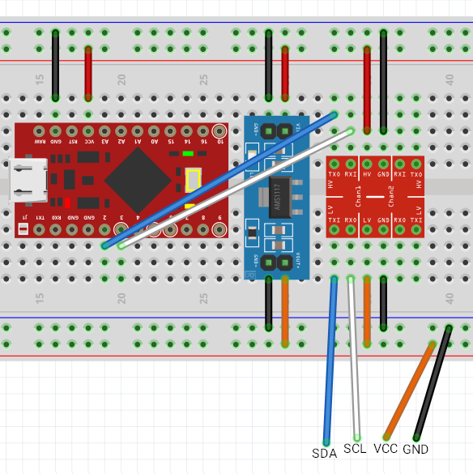
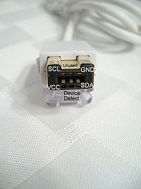

# Arduino Wiitar adapter

## Features

Everything works: 5 fret buttons, strum up/down, +/- buttons, stick and whammy.

## Requirements

* Board with an ATmega32u4 processor (Arduino Leonardo, SparkFun Pro Micro)
* AMS1117 module or similar (5V -> 3.3V)
* Bi-directional logic level converter (5V <-> 3.3V)

You can *technically* omit the last two items if you like risking (Wii Nunchucks can work at 5V, but I haven't seen anyone conencting wiitars to 5V).

## Wiring

Safe wiring with SparkFun Pro Micro:

Unsafe wiring with SparkFun Pro Micro:

Wiitar connector pinout ([source](http://www.wiibrew.org/wiki/Wiimote/Extension_Controllers)):

Connect VCC to VCC, GND to GND etc.

You can just jam jumper wires into the little holes above the big hole (like I did), or you can buy/make one of [these](https://www.instructables.com/id/Wii-Nunchuck-Adapter/).
