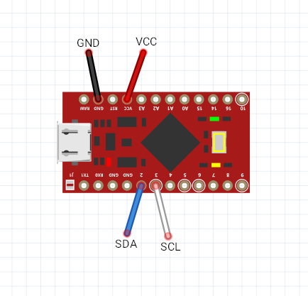

# Arduino Wiitar adapter

## Features

* 5 frets, strum up/down, +/- buttons, stick, **whammy**
* Optional packet verification, if your connection to the guitar is bad
* Optional Android support

## Requirements

* Board with an ATmega32u4 processor (Arduino Leonardo, SparkFun Pro Micro or cheaper clones). **Arduino Uno, Nano and many other popular boards are based on an ATmega168/328 processors, and thus are unsuitable**
* AMS1117 module or similar (5V -> 3.3V)
* Bi-directional logic level converter (5V <-> 3.3V)

You can omit the last two items if you have a 3.3V board or if you like risking (Wii Nunchucks can work at 5V, but I haven't seen anyone conencting wiitars to 5V).

## Dependencies

* [ArduinoJoystickLibrary](https://github.com/MHeironimus/ArduinoJoystickLibrary), installation instructions are in the projects README

## Wiring

Safe 5V wiring with SparkFun Pro Micro:

Unsafe 5V (safe 3.3V) wiring with SparkFun Pro Micro:

Wiitar connector pinout ([source](http://www.wiibrew.org/wiki/Wiimote/Extension_Controllers)):

Connect VCC to VCC, GND to GND etc.

You can just jam jumper wires into the little holes around the big hole (like I did), or you can buy/make one of [these](https://www.instructables.com/id/Wii-Nunchuck-Adapter/).
